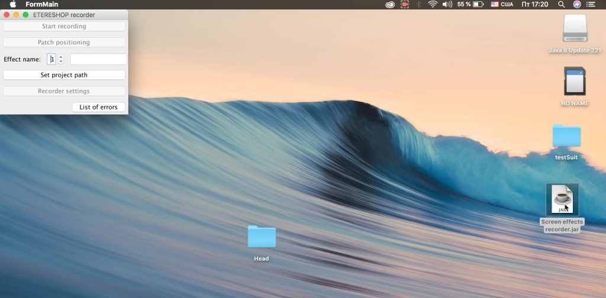
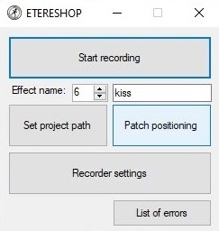
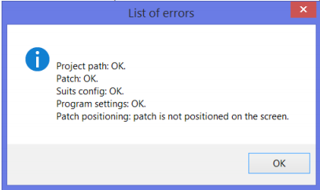
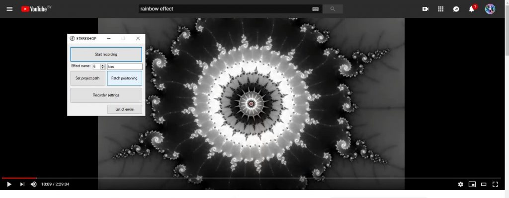
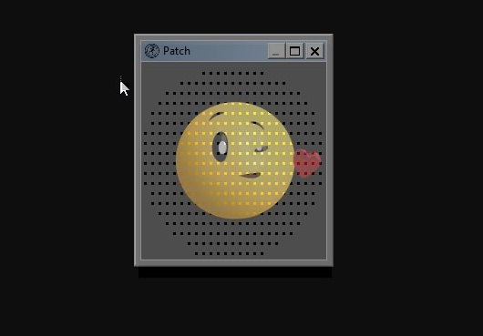
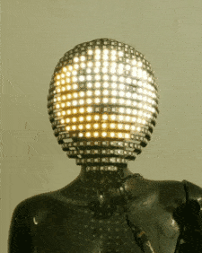

# LED Effects Programming using ETERESHOP Screen Grabber

For those who purchased our LED pixel products but don’t have much time to create your own effects — ETERESHOP offers a Screen Grabber tool. This software captures effects from any visual source and allows you to upload them directly to an SD card or controller for costumes.

---

## Step-by-Step Guide

<strong>Step 1 – Installation</strong>

### Links to download:

-  **Screen Grabber Software**  
  [Download from Google Drive](https://drive.google.com/open?id=10aBT7ypVH4dEwUHiFpJd8ZtK32170TGM)

-  **Test Project Folder**  
  [Access the test project folder](https://drive.google.com/drive/folders/1xDridVAwYPfzEgZEtESkR5W5KCjqOfQZ?usp=sharing)

-  **.NET Framework 4.5.2+** (Required for Windows)  
  [Download .NET Framework](https://dotnet.microsoft.com/en-us/download/dotnet-framework)

-  **Jinx! Software** (optional, for scrolling text or logos)  
  [Download from Live-LEDs](https://live-leds.de/downloads/)

### Windows

- Install or update **.NET Framework** (minimum version: 4.5.2). It is included with the recorder installer.
- Run the `.exe` file provided by our team to install the program.
- Close all unnecessary programs before recording — performance depends on your processor.
- Avoid full-screen recording. Use smaller windows for better performance.

### Mac OS

- Install or update **Java** to the latest version.
- Run the recorder using the `.jar` file.
- Allow system permissions if prompted (macOS blocks system control by default).
- Add the software to antivirus whitelist if necessary.

 

**Java (Latest Version Required)**  
  [Download Java](https://java.com/en/download/)

**macOS Installation Help**  
  [Java Install Instructions for Mac](https://java.com/en/download/help/mac_install.xml)

⚠️ If you receive a **mouse hook fail** message, go to **System Preferences → Security & Privacy** → enable checkbox for "Jar Launcher".

---

<strong>Step 2 – Check compatibility options </strong>

After installation, set compatibility options depending on your Windows version:

- **Windows 7 / 8 / 8.1**:  
  - Right-click on the program file  
  - Go to `Compatibility` tab  
  - Enable `Disable display scaling on high DPI settings`  
  - Click OK  

- **Windows 10**:  
  - Right-click on the program file → `Compatibility` tab  
  - Click `Change settings for all users`  
  - In the new window, click `Change high DPI settings`  
  - Enable `Override high DPI scaling behavior`  
  - Set `Scaling performed by: Application`  
  - Confirm all windows by clicking OK

---

<strong>Step 3 – Run the Recorder and Capture Effect</strong>

### Initial Setup

- Open the program.
- Grant permissions on macOS if requested.
- Set the **project path** using the button.
- Ensure `List of errors` displays correct values.

 

### Patch Positioning

Check the quick start to see how the program will work. To do it you’ll need a project folder (you must have received it from us together with a costume).
Set the project path by clicking on a button with the same name and choose the project folder on your computer. Check the ‘List of errors’. The data must look like that:

Press ‘Patch positioning’ button, set patch position by dragging the window and choose the size of an area you want to record effects from.

Patch window is transparent and you can see through it. Close patch window by pressing close button. Program will save the effect to the corresponding folder.

**NOTE! You can’t change patch position or size when effect recording has started.**

Now ‘Start recording’ button must be active. Press ‘Start’ and you will see patch window with recording info string at the top. You can stop recording by pressing standard close window button.

**NOTE! The cursor moving in a selected area won’t be recorded as a future effect. Make sure that no other windows will open during the recording process**

 

**NOTE! For an example above (Smart LED dress ‘Eva’) we wanted to demonstrate text on a belt. We’ve used Jinx! program but you can also use Madrix software for the same purpose.**

---

<strong>Step 4 – Recorder Settings</strong>

You can modify the following options via the `Recorder Settings` button:

- **FPS (Frames Per Second)**:  
  Usually set to 60, but can be lowered for performance issues.

- **Record Timer**:  
  Duration of the recording.  

- **Start Command Settings**:  
  Configure how many clicks and which mouse button initiates the recording.

- **Delayed Start**:  
  Add a timer delay after pressing `Start Recording`. Set to `0` to disable.

---

<strong>Step 5 – Upload Effects to Your Costume</strong>

- All recorded effects are saved in the `Effects` folder within your project folder.
- Copy them to the SD card of your LED controller.
- Insert the card into the costume and enjoy your result!

---

---

## Useful Links

- [Knowledge Base Article](https://etereshop.zohodesk.com/portal/en/kb/articles/led-effects-programming-using-etereshop-screen-grabber)  
- [.NET Framework Download](https://dotnet.microsoft.com/en-us/download/dotnet-framework)  
- [Java Download](https://java.com/en/download/)  
- [Java Install Help for macOS](https://java.com/en/download/help/mac_install.xml)  
- [Live LEDs Tools](https://live-leds.de/downloads/)  
- [Google Drive – Project Folder](https://drive.google.com/drive/folders/1xDridVAwYPfzEgZEtESkR5W5KCjqOfQZ)

